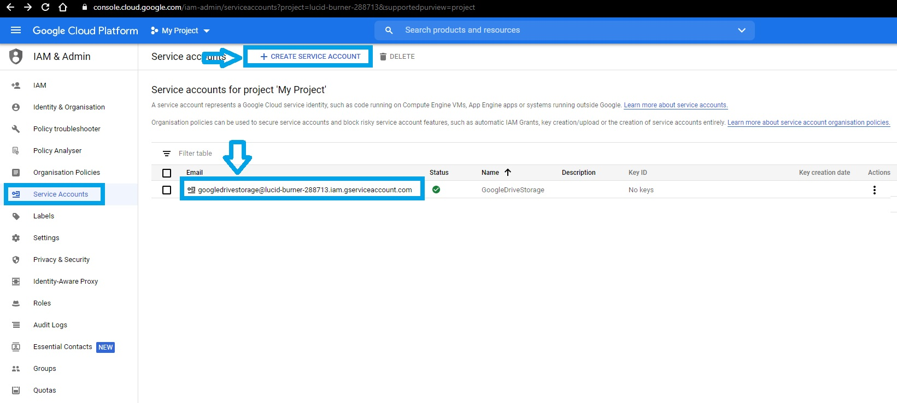

# Coding Tranquillity | Django Blog with Authentication, Coding-Articles, Likes and Comments

[***See the Live Application***](https://codingtranquillity.herokuapp.com/)

Application Main Features:

- Responsive UI for desktop and mobile
- Register new user accounts with Log in/Log out
- Users passwords are stored as a hash in the database (not as plain text)
- Users can edit their own information such as username, email, first/last name
- Users can leave likes and comments on each blog article
- Users with `add_blogpost` permission can create/edit/delete main blog articles directly from front-end (these options are not shown in the front-end for normal users without `add_blogpost`  permission)
- URL routes are not directly accessible if conditions are not met (eg. `LoginRequired`)
- Rich Text-Editor for blog articles and comments (with text formatting, code snippets, links and images using CKEditor)
- Media Files are stored using Google Drive Storage (free alternative to Amazon S3 Bucket)
- Site deployed using a free Heroku plan with PostgreSQL as DB.

<br/>

## Contents

- [Django Blog with Authentication, Coding-Articles, Likes and Comments](#django-blog-with-authentication-coding-articles-likes-and-comments)
  - [Contents](#contents)
  - [Screenshots](#screenshots)
  - [Requirements and Versions used](#requirements-and-versions-used)
  - [Setting up and Running the project](#setting-up-and-running-the-project)
    - [Set up a SECRET KEY](#set-up-a-secret-key)
      - [Option 1: Keep the secret key and debug value in System's environment variables](#option-1-keep-the-secret-key-and-debug-value-in-systems-environment-variables)
      - [Option 2: Keep secret key and debug value in settings.py](#option-2-keep-secret-key-and-debug-value-in-settingspy)
    - [Set up Media Storage](#set-up-media-storage)
      - [Option 1: Setting up Media Storage in Google Drive Storage (cloud)](#option-1-setting-up-media-storage-in-google-drive-storage-cloud)
      - [Option 2: Setting up Media Storage in localhost](#option-2-setting-up-media-storage-in-localhost)
    - [Run the app](#run-the-app)
  - [Known bugs](#known-bugs)
  - [Credits and Resources used](#credits-and-resources-used)
  - [Find me on Social Networks](#find-me-on-social-networks)
  - [License](#license)
  
<br/>

## Screenshots


*Background Photo by [Jordan Whitt](https://unsplash.com/@jwwhitt?utm_source=unsplash&utm_medium=referral&utm_content=creditCopyText) on [Unsplash](https://unsplash.com/photos/EerxztHCjM8)*


<br/>

## Project Structure

```
DjangoPublishingPlatform/
┣ assets/
┃ ┣ admin/
┃ ┣ css/
┃ ┃ ┣ bootstrap.css
┃ ┃ ┣ bootstrap.min.css
┃ ┃ ┣ clean-blog.css
┃ ┃ ┗ clean-blog.min.css
┃ ┣ img/
┃ ┃ ┣ about-bg.jpg
┃ ┃ ┣ contact-bg.jpg
┃ ┃ ┣ home-bg.jpg
┃ ┃ ┣ post-bg.jpg
┃ ┃ ┗ post-sample-image.jpg
┃ ┗ js/
┃   ┣ bootstrap.bundle.min.js
┃   ┣ bootstrap.min.js
┃   ┣ clean-blog.js
┃   ┣ clean-blog.min.js
┃   ┣ contact_me.js
┃   ┣ jqBootstrapValidation.js
┃   ┣ jquery.min.js
┃   ┗ jquery.slim.min.js
┃
┣ DjangoPublishingPlatform/
┃ ┣ asgi.py
┃ ┣ settings.py
┃ ┣ urls.py
┃ ┣ wsgi.py
┃ ┗ __init__.py
┃
┣ MainApp/
┃ ┣ admin.py
┃ ┣ apps.py
┃ ┣ forms.py
┃ ┣ models.py
┃ ┣ sitemaps.py
┃ ┣ tests.py
┃ ┣ urls.py
┃ ┣ views.py
┃ ┗ __init__.py
┃
┣ templates/
┃ ┣ MainApp/
┃ ┃ ┣ about.html
┃ ┃ ┣ base.html
┃ ┃ ┣ blogpost_confirm_delete.html
┃ ┃ ┣ blogpost_detail.html
┃ ┃ ┣ blogpost_form.html
┃ ┃ ┣ contact.html
┃ ┃ ┣ index.html
┃ ┃ ┣ post.html
┃ ┃ ┗ user_posts.html
┃ ┗ users/
┃   ┣ login.html
┃   ┣ logout.html
┃   ┣ profile.html
┃   ┣ register.html
┃   ┗ user_confirm_delete.html
┃
┣ users/
┃ ┣ admin.py
┃ ┣ apps.py
┃ ┣ forms.py
┃ ┣ models.py
┃ ┣ tests.py
┃ ┣ views.py
┃ ┗ __init__.py
┃
┣ manage.py
┣ Procfile
┗ requirements.txt
```

<br/>

## Requirements and Versions used

Python version used: +v3.7

You can refer to `requirements.txt` and install all the dependencies (in your custom Anaconda environment or your Linux Virtual Environment) by using:

```bash
pip install -r requirements.txt
```

<br/>

You can also install the latest versions of the modules used in this project, separately, by running:

```bash
pip install django
pip install django-crispy-forms
pip install django-ckeditor
pip install django-googledrive-storage
pip install django-heroku
pip install gunicorn
pip install pillow
```

<br/>

Note: To create a [Custom Anaconda Environment](https://docs.conda.io/projects/conda/en/latest/user-guide/tasks/manage-environments.html) and switch to it after it was created, run:

```bash
conda create -n django_blog
activate django_blog

# now install the packages via requirements.txt or install with pip separately
```

<br/>

## Setting up and Running the project

- Clone this repository:

```bash
git clone https://github.com/radualexandrub/CodingTranquillity-DjangoBlog.git
```

<br/>

### Set up a SECRET KEY

Before we start running the app, we need to generate a [secret key](https://stackoverflow.com/questions/7382149/whats-the-purpose-of-django-setting-secret-key). Note: Make sure that the key used in production isn't the same as the one used in development (localhost).

We can generate a secret key using https://djecrety.ir/

Or, open a Command Prompt / Terminal and, in a Python3 environment, write:

```python
import secrets
print(secrets.token_hex(24))
```

#### Option 1: Keep the secret key and debug value in System's environment variables

This project currently uses environments variables in its `./DjangoPublishingPlatform/settings.py`:

```python
# settings.py
SECRET_KEY = os.environ.get('SECRET_KEY')
DEBUG = (os.environ.get("DEBUG_VALUE") == "True")
```

On **Windows**, open the start menu and search for "environment variables", select `Edit the system environment variables`, click on `Environment Variables`. under "User variables" click on `New...` and write the followings:

- `Variable name`: SECRET_KEY<br/>`Variable value`: (your generated secret key)
- `Variable name`: DEBUG_VALUE<br/>`Variable value`: True


On **Linux**, if you are **not** running Python in a custom virtual environment, then open your `bash_profile` file:

```nash
sudo nano ~/.bash_profile
```

Add to the end of the file the followings:

```
export SECRET_KEY="your_secret_key"
export DEBUG_VALUE="True"
```

Save and quit (press `CTRL+X` then type `y` for Nano editor).

[If you're using a virtual ENV, you can add the environment variables to that specific environment](https://stackoverflow.com/questions/44693485/where-do-i-set-environment-variables-for-django), by opening:

```
sudo nano your_environment_name/bin/activate
```

Then write the same "exports" at the end of the file. Restart your ENV for changes to take effect.

#### Option 2: Keep secret key and debug value in settings.py

If you don't want to store anything in your system variables (eg. for running the project only on your machine, only you developing it and without any intention of pushing the source code on GitHub while deployed), just open `./DjangoPublishingPlatform/settings.py` and replace `SECRET_KEY` and `DEBUG` variables with `"True"`, and `"your_secret_key"`.

<br/>

---

### Set up Media Storage

#### Option 1: Setting up Media Storage in Google Drive Storage (cloud)

This project currently uses [Django Google Drive Storage](https://django-googledrive-storage.readthedocs.io/en/latest/) in order to store the media files (photos) that are uploaded by users. 

In order to use this cloud based storage, you need to have a `lucid-burner.json` file (*GOOGLE_DRIVE_STORAGE_JSON_KEY_FILE*) that you can obtain from [developers.google.com](https://developers.google.com/identity/protocols/oauth2/service-account).

- First, open [console.cloud.google.com](https://console.cloud.google.com/projectselector2/iam-admin/serviceaccounts?pli=1&supportedpurview=project) and log in with your current Google Account
- Click on `CREATE PROJECT` and follow the corresponding steps on creating a new project
- Open your new project and click on `CREATE SERVICE ACCOUNT` (Pick any name, eg. GoogleDriveStorage), then click on `DONE`<br/>
- Open your newly created "Service Account" and click on `ADD KEY` -> `CREATE NEW KEY` -> `JSON`<br/>
- A new `lucid-burner.json` file was generated and downloaded. Make sure you place this `json` file in your Main Django Project directory (eg. where `./manage.py` is also located)
- Make sure in your `settings.py` that you have `gdstorage` and the path to your `lucid-burner.json` file:

```python
# settings.py
INSTALLED_APPS = [
     ...
     'gdstorage'
 ]
 
GOOGLE_DRIVE_STORAGE_JSON_KEY_FILE = os.path.join(
    BASE_DIR, 'lucid-burner.json')
GOOGLE_DRIVE_STORAGE_MEDIA_ROOT = os.path.join(BASE_DIR, 'media')
```

- Make sure in your `models.py` you use `gdstorage`:

```python
# ./MainApp/models.py
from gdstorage.storage import GoogleDriveStorage

# Define Google Drive Storage
gd_storage = GoogleDriveStorage()

class BlogPost(models.Model):
    ...
    image = models.ImageField(upload_to='blog_images',
                              storage=gd_storage, null=True, blank=True)
```

- Make sure your form (where users can upload images via google drive storage) uses `enctype` property:

```html
<!-- ./templates/MainApp/blogpost_form.html -->
<form method="POST" enctype="multipart/form-data">
    
    <div class="control-group">
        {{ form.media }}
    </div>
    <button class="btn" type="submit">Create this article!</button>  
</form>
```


#### Option 2: Setting up Media Storage in localhost

If you don't want to use Google Drive (Cloud) Storage for your media files, then:

- In `settings.py`, remove `gdstorage` from `INSTALLED_APPS` and also remove `GOOGLE_DRIVE_STORAGE_JSON_KEY_FILE` and `GOOGLE_DRIVE_STORAGE_MEDIA_ROOT` variables.
- In `models.py`, remove the settings made for using Google Drive Storage (written above), and add/replace to your class model the following:

```python
class BlogPost(models.Model):
    ...
    image = models.ImageField(upload_to='blog_images')
```

- After every change in the `models.py` file, open the terminal and make the migrations to the database:

```bash
# CLI/Terminal
>> cd C:\Projects\...\YourDjangoAppMainFolder
>> python manage.py makemigrations
>> python manage.py migrate
```

<br/>

---

### Run the app

Open Cmd Prompt/Terminal in the project's path and run `runserver` command:

```bash
cd ./PathToProject/DjangoPublishingPlatform
python ./manage.py runserver
```

Open your favorite Browser at the address: `http://localhost:8000/`.

<br/>

## Known bugs

- The application is not so responsive on mobile:
  - Comment Section in each Blog Post is larger than the screen size, needing to scroll horizontally
  - Comment Form is larger than the screen size, needing to scroll horizontally
  - Images in Blog Posts can be larger than the screen size, needing to scroll horizontally
- Empty comments can still be posted (needs a check `""` condition)
- The search articles option can display a maximum of 10 posts, the rest of the pages will redirect user to the main index page
- The App does not have a custom 404 page

<br/>

## Credits and Resources used

- [Corey's Schafer 10h tutorial on creating a Full-Featured Web App](https://www.youtube.com/playlist?list=PL-osiE80TeTtoQCKZ03TU5fNfx2UY6U4p)
- [HTML and CSS Bootstrap theme from StartBootstrap.com](https://startbootstrap.com/theme/clean-blog)
- [Pexels](https://www.pexels.com/) and [Unsplash](https://unsplash.com/) - Free Stock Photos
- [Django Crispy Forms](https://github.com/django-crispy-forms/django-crispy-forms)
- [Django CKEditor - Rich Text-Editor for Input Forms](https://github.com/django-ckeditor/django-ckeditor)
- [Heroku - cloud platform for hosting web applications](https://www.heroku.com/)
- [Cron-job.org - Scheduled execution of your websites](https://cron-job.org/en/) - used to prevent Heroku's dyno (server) from going to sleep after 30 minutes of Website inactivity.

<br/>

## Find me on Social Networks

***My portfolio:*** [radubulai.com](https://radualexandrub.github.io/)<br>
***My blog:*** [CodingTranquillity](https://codingtranquillity.herokuapp.com/)

<a href="https://github.com/radualexandrub" target="_blank"></a>&nbsp;&nbsp;
<a href="https://www.linkedin.com/in/radu-alexandru-bulai/" target="_blank"></a>&nbsp;&nbsp;
<a href="https://dev.to/radualexandrub" target="_blank"></a>&nbsp;&nbsp;
<a href="https://www.hackerrank.com/RaduAlexandruB" target="_blank"></a>&nbsp;&nbsp;
<a href="https://www.flickr.com/photos/radualexandru" target="_blank"></a>&nbsp;&nbsp;
<a href="https://www.mixcloud.com/radu-alexandru7" target="_blank"></a>&nbsp;&nbsp;

<br/>

## License

Released under the [MIT license](LICENSE).
